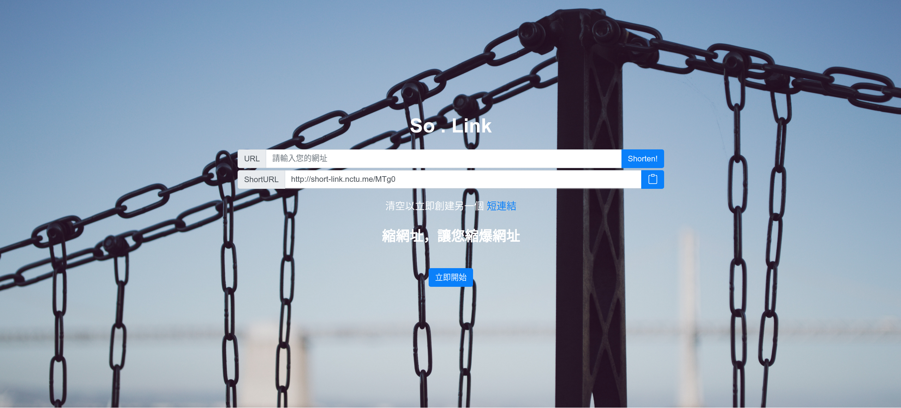
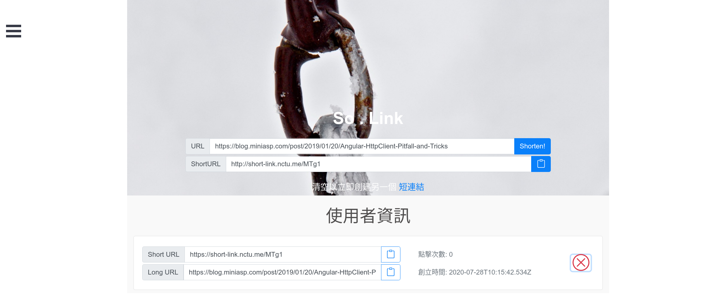

# So . Link 縮網址

## First look

## About So . Link project
A handy shorten URL tool is preparing for you to access any website with a tiny URL.

## Prerequisites
* npm
* MongoDB
* Node.js
* Vue.js
* A google account (for GAuth)

## Setup and installation  
1. Modify config file in `front-end/src` and add a GAuth `client_id`.
2. Install dependencies
* `$ git clone https://github.com/TWcamel/short-link.git`
*  `$ cd front-end && npm i && npm run serve`
*  `$ cd .. && cd server && npm i && npm run start`
3. Create a mongo user
4. Modify config file in `server` to your local mongoDB configuration.
5. enjoy!😄

## Team Members
[Steven Yang](https://github.com/feveral)
* Back-end development.
* Build up GAuth signin and most of API.
* Database and model configuration, back-end automation testing and Node.js scheduler integration.
* Cooperate with team members to come up with a better stories.

[Samuel Huang](https://github.com/TWcamel)
* Front-end development.
* Build up some API.
* Buildding view and components in this website.
* Cooperate with team members to come up with a better stories.
* Code review for teammates.